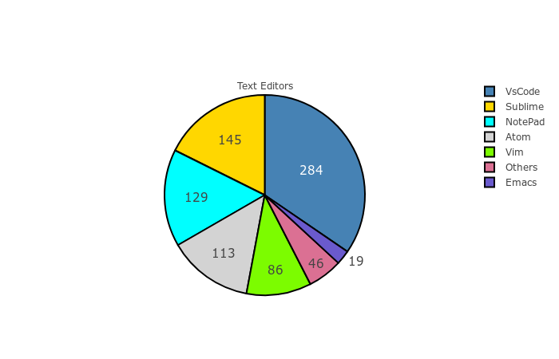
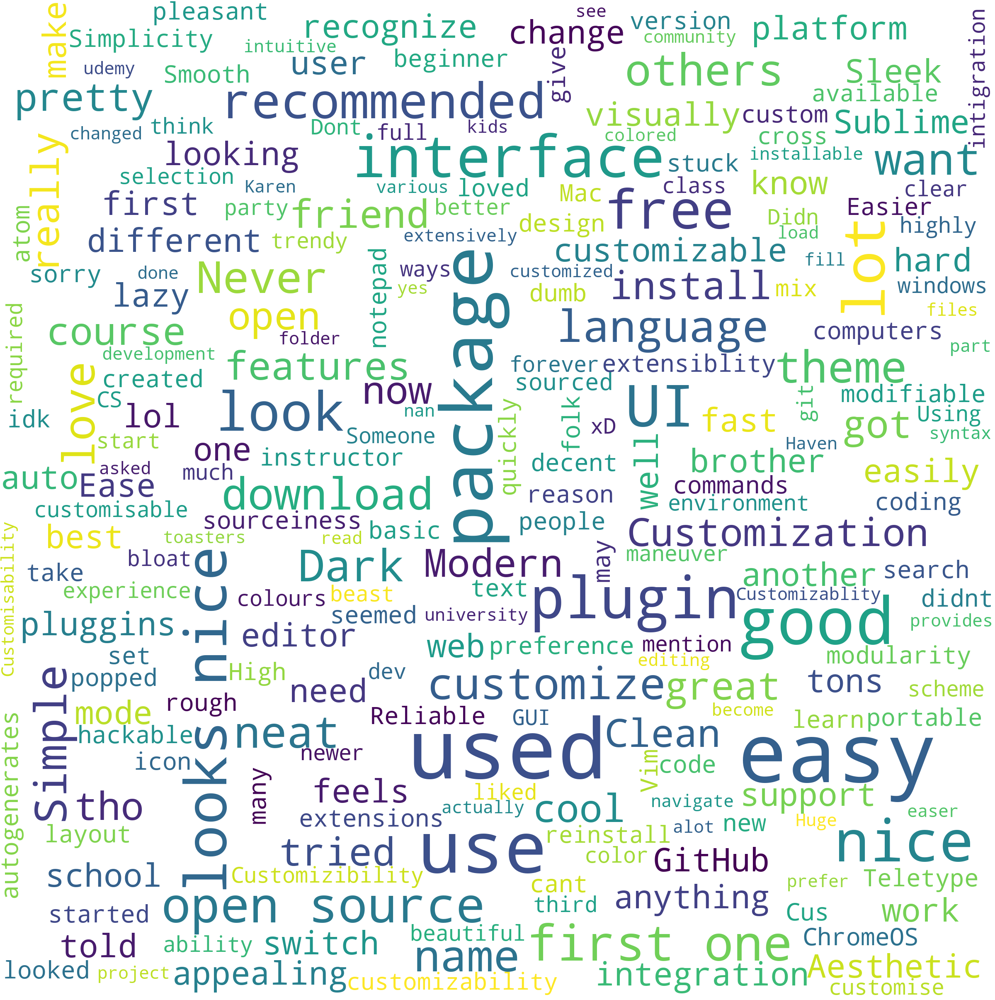
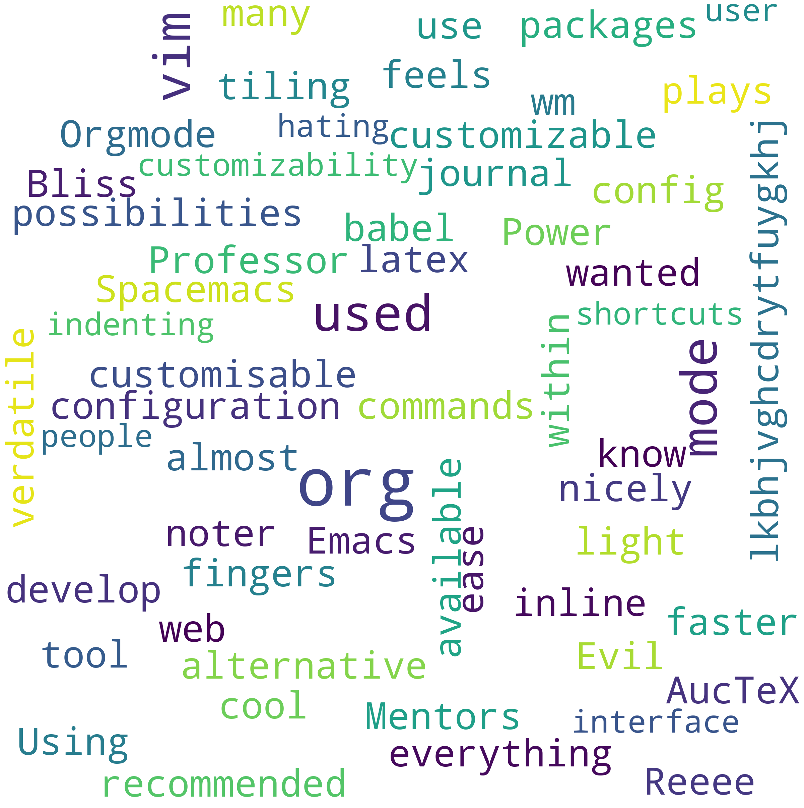
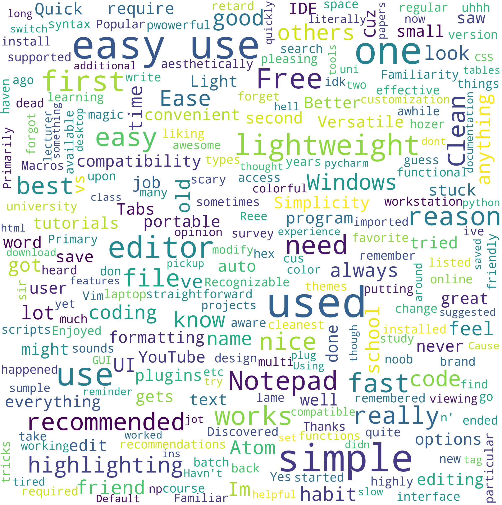
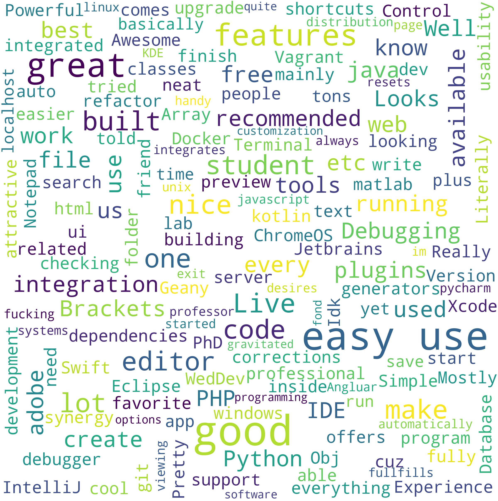
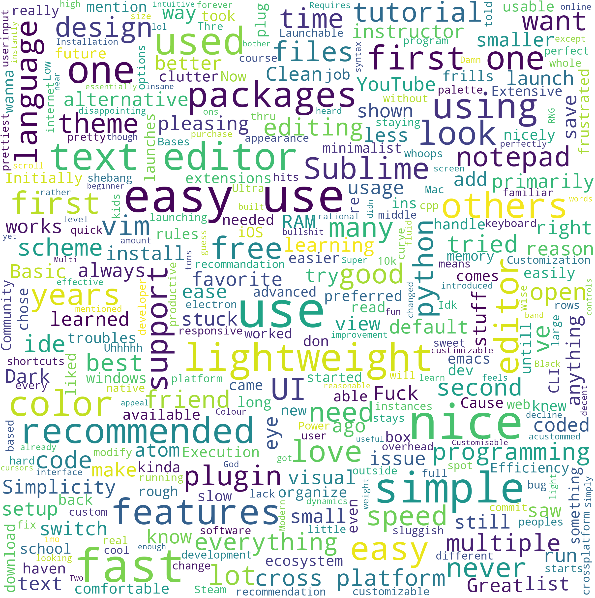
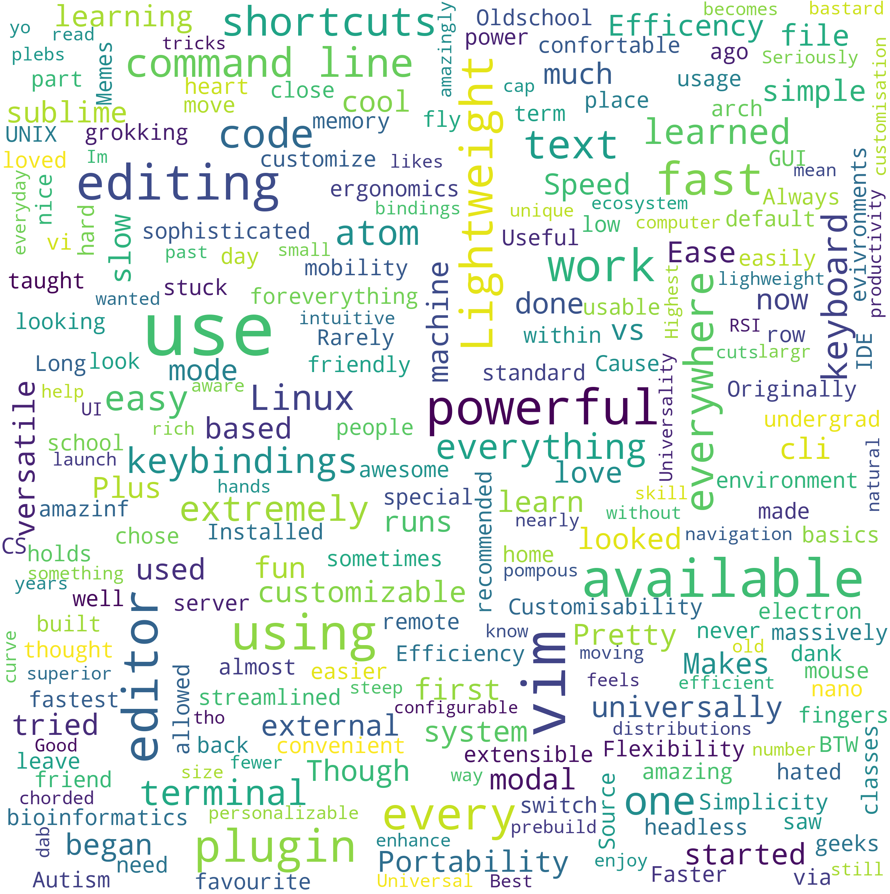
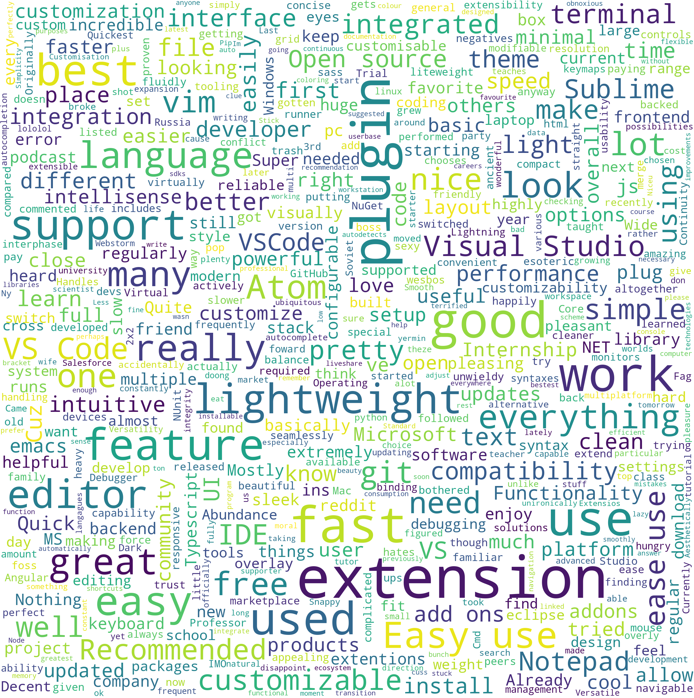

# Visualization of Survey Results
A simple side project that uses data visualization libraries to visualize the data that was collected from a survey.

## Installion
- This project requires `Anaconda` distribution since it uses most of the libraies that comes with that distribution.
- [Install Anaconda](https://docs.anaconda.com/anaconda/install/)
- This project uses libraries such as `pandas`,`pyplot`,`pil`,`numpy`
- `pip install wordcloud` to create a wordcloud
- `pip install jupyter-notebook`

## Usage
- `jupter-notebook <name of the notebook>`
- You can view the `.html` file too.

## PieChart

**Note**: Open `visualization.html` file to view interactive piechart

## WordCloud
Since there were so many comments so I decided to create a wordcloud from those comments.

##### Atom
 
##### Emacs
 
##### Notepad
 
##### Others
 
##### Sublime

##### Vim 

##### Vscode

**Note** : Other contains text editors like `php-storm`,`eclipse`,`pycharm` and etc.

Feel free create PR if you have any creative idea on how to use this data.
